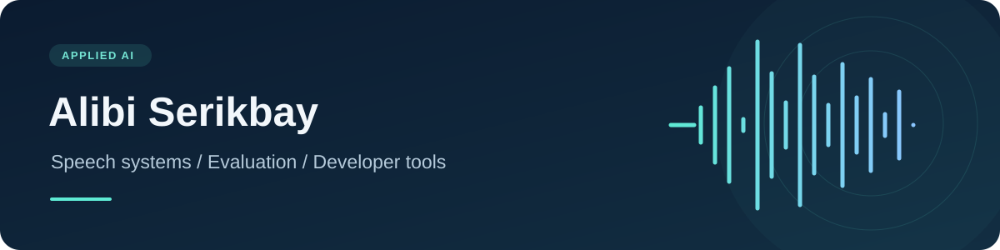

  

  <a href="https://huggingface.co/alibiserikbay/kazakh-russian-mixed-stt">Speech models</a> ·
  <a href="https://github.com/allebee">GitHub</a> ·
  <a href="https://www.linkedin.com/in/alibi-serikbay/">LinkedIn</a>

### Hi, I'm Alibi

I'm an AI engineer based in Astana. I work on speech recognition, model evaluation, and small tools that make AI systems easier to use and verify.

### Featured work

| Project | What it does |
| --- | --- |
| **[Kazakh & Russian STT](https://github.com/allebee/kazakh-russian-mixed-stt)** · [models on Hugging Face](https://huggingface.co/alibiserikbay/kazakh-russian-mixed-stt) | TorchScript speech recognition for Kazakh, Russian, and mixed speech. The GitHub repo has a simple inference script; Hugging Face hosts the weights and full model card. |
| **[Jev](https://github.com/allebee/jevk5)** | An open decision model that returns typed answers and calibrated probabilities in one pass. |
| **[pytest-jev](https://github.com/allebee/pytest-jev)** | Semantic assertions for testing what an LLM application's output means. |
| **[jevgrep](https://github.com/allebee/jevgrep)** | Search streams and logs by meaning with a plain-English yes/no question. |

### What I'm focused on

- Practical speech recognition for Kazakh and Russian, including mixed-language audio.
- Evaluations that expose errors and uncertainty clearly.
- Tools that turn model research into something another developer can run.

If you're working on speech technology or reliable AI tools, [get in touch on LinkedIn](https://www.linkedin.com/in/alibi-serikbay/).
